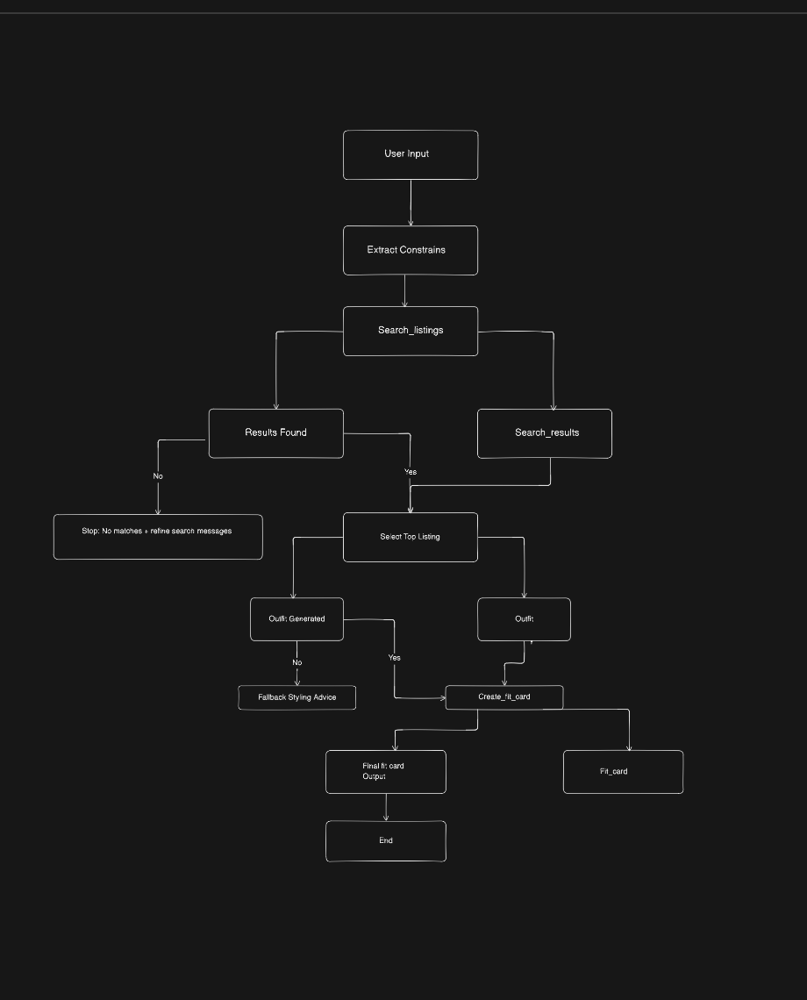

# FitFindr — planning.md

> Complete this document before writing any implementation code.
> Your spec and agent diagram are what you'll use to direct AI tools (Claude, Copilot, etc.) to generate your implementation — the more specific they are, the more useful the generated code will be.
> Your planning.md will be reviewed as part of your submission.
> Update it before starting any stretch features.

---

FitFindr helps users to find secondhand clothing items, build outfits using pieces they already own, and generate a social-media-style fit card. The search_listing tool finds matching listings based on the user's query and filters, such as size and price. If a matching item is found, the suggested outfit uses the selected listing and the user’s wardrobe to create a styling recommendation, and then create_fit_card turns that outfit into a shareable caption. If search_listing returns no results, FitFindr should explain why no matches were found, suggest alternative search criteria, and stop without calling the other tool

## Tools

List every tool your agent will use. For each tool, fill in all four fields.
You must have at least 3 tools. The three required tools are listed — add any additional tools below them.

### Tool 1: search_listings

**What it does:**
<!-- Describe what this tool does in 1–2 sentences -->
Searches the listings dataset for clothing items that match the user's request. It filters listings based on keywords, size, price, and style-related information, then returns the most relevant matches.

**Input parameters:**
<!-- List each parameter, its type, and what it represents -->
- `description` (str): User's search query or item description ("vintage graphic tree")
- `size` (str): Desired clothing size ("M", "L", etc)
- `max_price` (float): Maximum price the user is willing to pay

**What it returns:**
<!-- Describe the return value — what fields does a result contain? -->
id (str)
title (str)
description (str)
category (str)
style_tags (list[str])
size (str)
condition (str)
price (float)
colors (list[str])
brand (str | None)
platform (str)

**What happens if it fails or returns nothing:**
<!-- What should the agent do if no listings match? -->

The Agent should tell the user that no matching listings were found and suggest modifying the search criteria. The workflow should stop and not call suggest_outfit or create_fit_card.

### Tool 2: suggest_outfit

**What it does:**
<!-- Describe what this tool does in 1–2 sentences -->

Creates a styling recommendation by combining a newly found listing with items from the user's wardrobe. It selects wardrobe pieces that match the item's style, colors, and category to form a complete outfit.

**Input parameters:**
<!-- List each parameter, its type, and what it represents -->
- `new_item` (dict): The selected listing from search_listings
- `wardrobe` (dict): User wardrobe data following the wardrobe schema.

**What it returns:**
<!-- Describe the return value -->
Styling description (str)
Recommended wardrobe items (list)
Suggested accessories or shoes (optional)
Explanation of why the pieces work together (str)

**What happens if it fails or returns nothing:**
<!-- What should the agent do if the wardrobe is empty or no outfit can be suggested? -->
If the wardrobe is empty, the agent should provide general styling advice based only on the new item. If no strong matches exist in the wardrobe, the agent should suggest the closest matching pieces rather than failing completely.

---

### Tool 3: create_fit_card

**What it does:**
Generates a short, social-media-style caption based on the outfit recommendation. The goal is to create a fun and shareable description of the outfit.

**Input parameters:**
<!-- List each parameter, its type, and what it represents -->
outfit (dict): The outfit recommendation generated by suggest_outfit.
new_item (dict): The newly purchased or discovered clothing item.

**What it returns:**
A formatted fit card containing:
     Social media caption (str)
     Mention of the featured item
     Outfit styling summary
     Optional emojis and casual tone

**What happens if it fails or returns nothing:**
If outfit information is incomplete, the agent should generate a simpler caption using only the available item details. If there is not enough information to create a meaningful caption, it should return a brief description of the item instead.

### Additional Tools (if any)

None

## Planning Loop

**How does your agent decide which tool to call next?**
<!-- Describe the logic your planning loop uses. What does it look at? What conditions change its behavior? How does it know when it's done? -->

---

The agent works in a strict 3-step pipeline and only advances when the previous step succeeds.

First, it reads the user’s request and extracts constraints like item type, size, budget, and style. It then calls search_listings to retrieve matching items. If results are returned, the agent selects the top (most relevant) listing and proceeds to the next step.

Next, it calls suggest_outfit using:

     the selected listing (new_item)
     the user’s wardrobe

If an outfit is successfully generated, it proceeds to create_fit_card to produce a final social-style caption.

The process always ends after the fit card is created. If search_listings returns nothing, the loop stops immediately and returns a helpful “no results found” message.

## State Management

**How does information from one tool get passed to the next?**
The agent transfers data between tools using a straightforward session state:

     user_query: the initial request from the user

     search_listings' output is search_results.

     selected_item: the listing that was selected (typically the top result)

     wardrobe: user wardrobe (using an empty template or an example)

     outfit: suggest_outfit's output

     fit_card: the result of create_fit_card

     Every tool writes back to the shared state after reading only what it requires. The most crucial change is:

     search_results → outfit → fit_card → selected_item.

     The wardrobe is loaded at the beginning of the session and utilized repeatedly.

## Error Handling

For each tool, describe the specific failure mode you're handling and what the agent does in response.

| Tool | Failure mode | Agent response |
|------|-------------|----------------|
| search_listings | No results match the query | Stop workflow immediately, inform user no matches were found, suggest adjusting size/price/keywords, and do not call other tools|
| suggest_outfit | Wardrobe is empty | Fall back to basic styling advice using only the new item; if no item exists, stop and request valid input |
| create_fit_card | Outfit input is missing or incomplete | Fall back to basic styling advice using only the new item; if no item exists, stop and request valid input |

---

## Architecture

<!-- Draw a diagram of your agent showing how the components connect:
     User input → Planning Loop → Tools (search_listings, suggest_outfit, create_fit_card)
                                                                          ↕
                                                                   State / Session
     Show what triggers each tool, how state flows between them, and where error paths branch off.
     ASCII art, a Mermaid diagram (https://mermaid.js.org/syntax/flowchart.html), or an embedded
     sketch are all fine. You'll share this diagram with an AI tool when asking it to implement
     the planning loop and each individual tool. -->

---

## AI Tool Plan

<!-- For each part of the implementation below, describe:
     - Which AI tool you plan to use (Claude, Copilot, ChatGPT, etc.)
     - What you'll give it as input (which sections of this planning.md, your agent diagram)
     - What you expect it to produce
     - How you'll verify the output matches your spec before moving on

     "I'll use AI to help me code" is not a plan.
     "I'll give Claude my Tool 1 spec (inputs, return value, failure mode) and ask it to implement
     search_listings() using load_listings() from the data loader — then test it against 3 queries
     before trusting it" is a plan. -->

**Milestone 3 — Individual tool implementations:**
I will give claude my tool 1 spec inputs, return value, failure mode and ask it implemented the functions for milestone 3 and making sure that it follows through all the todos. using load_listing for the data loader then I will trouble check based on the TODOS.

Other tools will be pretty much be the same way, and double checking my work, and making that the AI follows the TODOs

**Milestone 4 — Planning loop and state management:**

I will give claude for the planning loop and state management and sending the architecture to build the loop and state management initially and double check my work, when is completed. 

## A Complete Interaction (Step by Step)

Write out what a full user interaction looks like from start to finish — tool call by tool call. Use a specific example query.

**Example user query:** "I'm looking for a vintage graphic tee under $30. I mostly wear baggy jeans and chunky sneakers. What's out there and how would I style it?"

**Step 1:**
<!-- What does the agent do first? Which tool is called? With what input? -->

The agent first parses the user Query inside run_agent() and no external tool is called yet

Input: 
description = "vintage graphic tee"
size = None
max_price = 30

**Step 2:**
<!-- What happens next? What was returned from step 1? What tool is called now? -->

The agent calls the first tool:
search_listings(
    description="vintage graphic tee",
    size=None,
    max_price=30
)

Loads dataset using load_listings()
Filters listings by price (≤ 30)
Optionally filters by size (none here)
Scores listings using keyword overlap (title, tags, description)
Sorts results by relevance

that is stored in session["search_result"]

**Step 3:**
<!-- Continue until the full interaction is complete -->
The agent selects the top-ranked listing 
Selected_item = session["Search_results"][0]

session["selected_item"]

then next is suggest_outfit
suggest_outfit(
     new_item=selected_item
     wardrobe=selected_wardrobe
)

Next steps is
if the wardrobe has items -> matches outfits wardrobe pieces
if wardrobe is empty -> gives general styling advice
uses Groq LLM
Generates 1-2 combination with explanations

that is stored in 
Session["outfit_suggestion"]

then calls 
create_fit_card(
    outfit=session["outfit_suggestion"],
    new_item=selected_item
)

then validates outfit is not empty
sends outfit + item data to Groq LLM
Generates a short social-media-style captions (2-4 sentences)
Mention item, price, and platform naturally.
which is stored in session["fit_card"]

**Final output to user:**
<!-- What does the user actually see at the end? -->

 Top listing found
Title: Y2K Baby Tee — Butterfly Print
Price: $18.0
Category: tops
Brand: None
Platform: depop

Description:
Super cute early 2000s baby tee with butterfly graphic. Fitted crop length. Tag says medium but fits like a small.

Style Tags: y2k, vintage, graphic tee, cottagecore
Colors: white, pink, purple
Size: S/M
Condition: excellent
👗 Outfit idea
I'd be happy to help you create some outfits using the Y2K Baby Tee — Butterfly Print. Here are two complete outfits that you can create using this thrifted item and specific pieces from your wardrobe:

**Outfit 1: Casual Chic**
Pair the Y2K Baby Tee — Butterfly Print with the Baggy straight-leg jeans, dark wash, and the Chunky white sneakers. This combination works stylistically because the dark wash jeans provide a nice contrast to the light and playful butterfly print on the tee. The chunky white sneakers add a sporty touch to the overall look, which complements the casual vibe of the graphic tee. To complete the outfit, you can add the Brown leather belt to add a touch of warmth and texture to the overall look.

**Outfit 2: Edgy Cottagecore**
Pair the Y2K Baby Tee — Butterfly Print with the Wide-leg khaki trousers and the Black combat boots. This combination may seem unexpected, but it works because the khaki trousers add a nice earthy tone to the overall look, which complements the pastel colors of the butterfly print. The black combat boots add an edgy touch to the outfit, which balances out the sweetness of the graphic tee. To complete the outfit, you can add the Vintage black denim jacket to add a cool and laid-back vibe to the overall look. The jacket will also help to ground the look and prevent it from feeling too sweet or childish.

In both outfits, the Y2K Baby Tee — Butterfly Print is the star of the show, and the other pieces are used to complement and enhance its unique style. The key is to balance out the playfulness of the graphic tee with other pieces that add contrast and texture to the overall look.

✨ Your fit card
Just threw on my fave Y2K Baby Tee — Butterfly Print and I'm feeling the casual chic vibes. Paired it with my trusty baggy jeans and chunky whites for a look that's equal parts comfy and stylish. Scored this cutie on depop for $18.0 and I'm obsessed - the perfect addition to my thrifted wardrobe.
Try these queries

